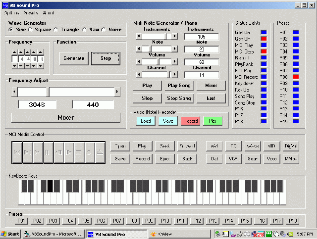



## DirectX MIDI oscilator Sound

### Description

Ultimate, Best, Finest VB Sound support application program, Easy to Understand VB Sound Support for all MCI functions.(Waves, MP3, MCI, MiDi, DirectX, AVIVideo, CDAudio, DAT, DigitalVideo, MMMovie, Sequencer, VCR, Videodisc, or WaveAudio). and for all MIDI Instrument (127 Instruments) functions and a 5 wave (Sine, Square, Triangle, SawTooth, Noise Waveforms)Oscilator (20HZ to 10KHZ) All on one form, no ctl's or bas files. A MUST SEE

The Multimedia MCI control manages the recording and playback of multimedia files on Media Control Interface (MCI) devices. Conceptually, this control is a set of push buttons that issues MCI commands to devices such as audio boards, MIDI sequencers, CD-ROM drives, audio CD players, videodisc players, and videotape recorders and players. The MCI control also supports the playback of Video for Windows (*.avi) files.

Multimedia MCI consists of a set of high-level, device-independent commands that control audio and visual peripherals. The first MCI command you issue is the Open command. This command opens the specified MCI device and identifies the file that will play on the device or be recorded by the device. Some devices, such as CDAudio, VCR, and videodisc, do not use files and do not require file names.

Once the device is open, you can issue any of the other MCI commands (Prev, Next, Pause, and so on). The Close command is the last MCI command you issue for the device, returning it to the available pool of system resources. The Close command also closes the data file associated with the device.
 
### More Info
 

             |
---                |---
**Submitted On**   |2009-05-29 17:07:22
**By**             |[scott93727](https://github.com/Planet-Source-Code/PSCIndex/blob/master/ByAuthor/scott93727.md)
**Level**          |Intermediate
**User Rating**    |5.0 (20 globes from 4 users)
**Compatibility**  |VB 4\.0 \(16\-bit\), VB 4\.0 \(32\-bit\), VB 5\.0, VB 6\.0
**Category**       |[Sound/MP3](https://github.com/Planet-Source-Code/PSCIndex/blob/master/ByCategory/sound-mp3__1-45.md)
**World**          |[Visual Basic](https://github.com/Planet-Source-Code/PSCIndex/blob/master/ByWorld/visual-basic.md)
**Archive File**   |[DirectX\_MI215397622009\.zip](https://github.com/Planet-Source-Code/scott93727-directx-midi-oscilator-sound__1-72124/archive/master.zip)

